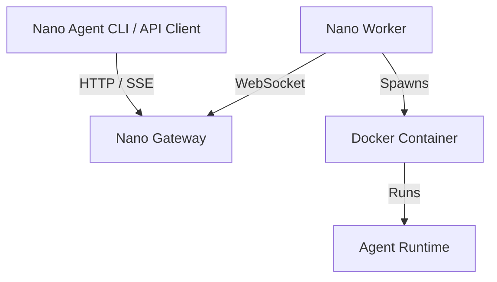

# Nano Cloud

[中文](./README.zh-CN.md)

> Part of the [nano series](https://nano-harness.github.io) — minimal implementations of agent loops & harness engineering: [nano-symphony](https://github.com/nano-harness/nano-symphony) · [nano-agent](https://github.com/nano-harness/nano-agent) · [nano-cloud](https://github.com/nano-harness/nano-cloud). Pairs with the [harness-101](https://github.com/albert-lv/harness-101) course.

Nano Cloud is the Gateway + Worker backend for the **Nano Agent** ecosystem. It lets agents execute tasks remotely in isolated Docker runtimes.



## What runs where?

- **Gateway**: central HTTP/WebSocket server, Console, run dispatch, pairing approval.
- **Worker**: connects to the Gateway and starts isolated Docker runtime containers.
- **Runtime images**: `nano-agent-runtime`, `nano-cli-runtime`, and optional network-policy runtime used by the Worker.

## 3-minute quick start

Use one entry point for first-time setup:

```bash
make quickstart
```

The wizard will:

1. create `.env` from `.env.example` if needed;
2. check Docker and Docker Compose;
3. ask for Gateway URL, LLM base URL, API key, model, mirror, and Go proxy;
4. build local runtime images when the sibling `../nano-agent` checkout is available;
5. start Docker Compose;
6. print the Console URL, approval steps, a sample run command, and diagnostics commands.

For the local default, open [http://localhost:8081/console](http://localhost:8081/console), login with `dev-token`, approve the pending Worker short code, then create a test run from the Console.

> If runtime image build is skipped because `../nano-agent` is missing, clone `nano-agent` next to this repository or provide prebuilt runtime images before running real `nano_agent` tasks.

## Daily commands

```bash
make quickstart   # configure and start Gateway + Worker
make logs         # follow compose logs
make stop         # stop services
make reset        # stop services and remove local .workdir state
make test         # run Go tests
```

## Remote Gateway mode

When connecting only a Worker to an existing remote Gateway:

```bash
make quickstart
```

Enter your remote relay URL, for example `wss://nano-gateway.example.com`. The wizard starts only the Worker service and prints the remote Console URL. Approve the Worker in that Console.

## Configuration

Most first-time users only need `.env`:

- `RELAY_URL`: Gateway relay URL, such as `ws://localhost:8081` or `wss://your-gateway.com`.
- `NANO_BASE_URL`: OpenAI-compatible LLM endpoint.
- `NANO_API_KEY`: LLM API key.
- `NANO_MODEL`: model name.
- `DOCKERHUB_MIRROR`, `GOPROXY`: optional acceleration settings.

Advanced Worker configuration lives in [`configs/worker.example.yaml`](configs/worker.example.yaml). The Worker CLI can also generate config files directly:

```bash
go build -o bin/worker ./cmd/worker
./bin/worker quickstart
./bin/worker diagnose -relay ws://localhost:8081 --verbose
```

## Console onboarding

The Console shows:

- Gateway health and current Worker status;
- pending Worker pairing requests and short-code approval;
- a minimal test-run form;
- recent runs, event links, and run detail diagnostics.

## Troubleshooting

Start with these commands:

```bash
make logs
./bin/worker diagnose -relay ws://localhost:8081 --verbose
```

Common causes:

- Docker daemon is not running.
- Worker was not approved in the Console.
- `NANO_API_KEY` or model settings are missing.
- Runtime images are missing.
- Proxy, Docker mirror, or `GOPROXY` settings are incorrect.

More low-level local debugging steps are in [`LOCAL_DEBUG.md`](LOCAL_DEBUG.md).

## Project structure

- `cmd/`: binaries for Gateway, Worker, and runtimes.
- `pkg/`: Gateway and Worker core logic.
- `proto/`: Runtime Protocol V1 protobuf definitions.
- `configs/`: example Worker configuration.
- `deployment/`: production Gateway deployment helper.
- `scripts/`: setup and local operation scripts.
- `docker/`: Gateway, Worker, and runtime Dockerfiles.

## Development

Requires Go 1.24+ and Docker.

```bash
go build ./...
go test ./...
```

Note: this repository currently uses `replace github.com/nano-harness/nano-agent => ../nano-agent`, so commands that build `cmd/runtime-nano-agent` require the sibling `../nano-agent` checkout.
