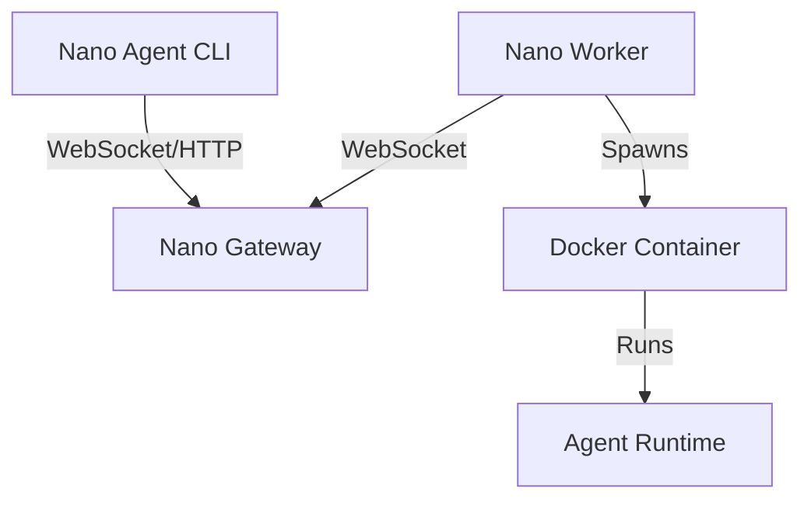

# Nano Cloud

The cloud infrastructure backend for the **Nano Agent** ecosystem. This repository provides the Gateway and Worker components that allow agents to execute tasks remotely in secure, isolated environments.



## 📚 Documentation

- **[Startup Guide](#quick-start)**: Start here! How to run the Gateway and Worker locally (see `scripts/setup-worker.sh`).
- **[Configuration](configs/worker.example.yaml)**: Example `worker-config.yaml` plus config notes.
- **[Deployment](deployment/deploy-gateway.sh)**: Deploy the Gateway to production servers (see `.github/workflows/deploy-gateway.yml`).
- **[Protocol Design](proto/runtime/v1/runtime.proto)**: Technical specification of the Runtime Protocol V1.

## Configuration Delivery

Gateway can deliver per-worker configuration via `/v1/worker/config` (ETag/If-None-Match). The payload contains:

- `worker_config_yaml`: Controls image/env/command per runtime (e.g. `claude_code`, `opencode`).
- `agent_config_yaml`: Mounted into runtime containers at `/root/.config/nano/config.yaml`.

### CLI Runtimes (Claude Code / OpenCode)

The `nano-cli-runtime` image uses an entrypoint wrapper that reads the `cli` section from `/root/.config/nano/config.yaml` and applies env/args for the selected runtime.

Example `agent_config_yaml`:

```yaml
cli:
  claude_code:
    env:
      ANTHROPIC_API_KEY: "${ANTHROPIC_API_KEY}"
    args: ["--model", "claude-3-7-sonnet"]
  opencode:
    env:
      OPENAI_API_KEY: "${OPENAI_API_KEY}"
    args: ["--model", "gpt-4.1-mini"]
```

## 🚀 Quick Start

1.  **Start Gateway**:
    ```bash
    go build -o gateway ./cmd/gateway
    ./gateway -addr :8081 -token "dev-token"
    ```

2.  **Configure Worker**:
    ```bash
    ./scripts/setup-worker.sh
    ```

3.  **Start Worker**:
    ```bash
    export NANO_API_KEY=sk-...  # Optional: Pass keys to agent
    go build -o worker ./cmd/worker
    ./worker -config worker-config.yaml
    ```

## 📂 Project Structure

- **`cmd/`**: Application entry points.
    - `gateway/`: The central server.
    - `worker/`: The node that manages Docker containers.
    - `runtime-*/`: Reference implementations of agent runtimes.
- **`pkg/`**: Core library code (Server logic, Worker logic).
- **`proto/`**: gRPC/Protobuf definitions for the runtime protocol.
- **`configs/`**: Example configuration files.
- **`deployment/`**: Scripts for deploying to cloud providers.
- **`scripts/`**: Helper scripts for local setup and operations.

## Development

This project requires **Go 1.22+** and **Docker**.

### Building
```bash
go build ./...
```

### Testing
```bash
go test ./...
```

## License

See LICENSE file.
