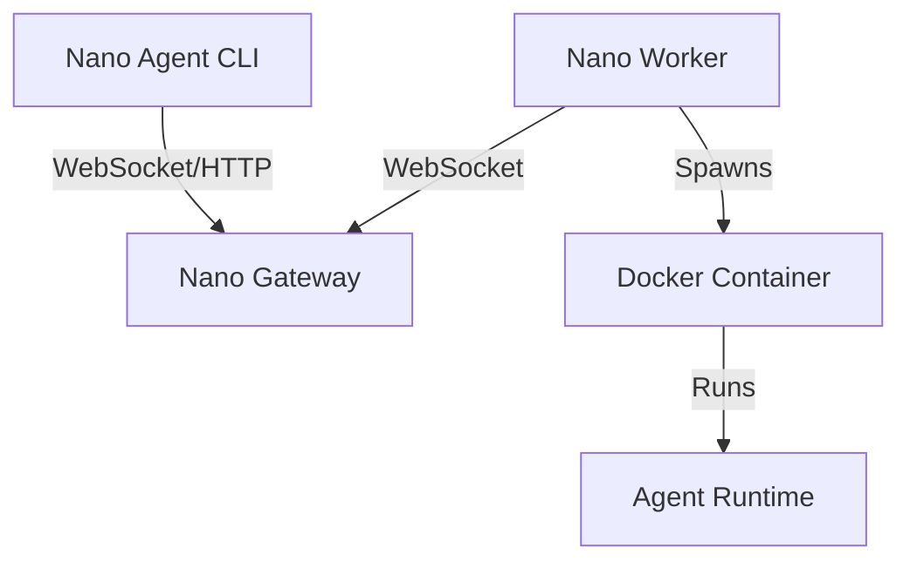

# Nano Cloud

The cloud infrastructure backend for the **Nano Agent** ecosystem. This repository provides the Gateway and Worker components that allow agents to execute tasks remotely in secure, isolated environments.



## 📚 Documentation

- **[Startup Guide](#quick-start)**: Start here! How to run the Gateway and Worker locally (see `scripts/setup-worker.sh`).
- **[Configuration](configs/worker.example.yaml)**: Example `worker-config.yaml` plus config notes.
- **[Deployment](deployment/deploy-gateway.sh)**: Deploy the Gateway to production servers (see `.github/workflows/deploy-gateway.yml`).
- **[Protocol Design](proto/runtime/v1/runtime.proto)**: Technical specification of the Runtime Protocol V1.

## Configuration Delivery

Gateway can deliver per-worker configuration via `/v1/worker/config` (ETag/If-None-Match). The payload contains:

- `worker_config_yaml`: Controls image/env/command per runtime (e.g. `claude_code`, `opencode`).
- `agent_config_yaml`: Mounted into runtime containers at `/root/.config/nano/config.yaml`.

### CLI Runtimes (Claude Code / OpenCode)

The `nano-cli-runtime` image uses an entrypoint wrapper that reads the `cli` section from `/root/.config/nano/config.yaml` and applies env/args for the selected runtime.

Example `agent_config_yaml`:

```yaml
cli:
  claude_code:
    env:
      ANTHROPIC_API_KEY: "${ANTHROPIC_API_KEY}"
    args: ["--model", "claude-3-7-sonnet"]
  opencode:
    env:
      OPENAI_API_KEY: "${OPENAI_API_KEY}"
    args: ["--model", "gpt-4.1-mini"]
```

## 🚀 Quick Start (Docker Compose)

The easiest way to run the full stack locally.

1.  **Build Runtimes** (Required):
    ```bash
    # Build the agent runtime images
    cd docker/nano-agent-runtime && docker build -t nano-agent-runtime:local .
    # Build the CLI wrapper runtime image
    cd ../cli-runtime && docker build -t nano-cli-runtime:local .
    cd ../..
    ```

2.  **Start Services**:
    ```bash
    # Configure and start services (Gateway + Worker)
    ./scripts/connect.sh
    # (Select 'ws://localhost:8081' when prompted)
    ```

3.  **Approve Worker**:
    *   Open [http://localhost:8081/console](http://localhost:8081/console)
    *   Login with token: `dev-token`
    *   Look for "Pending Pairing Requests" and click **Approve**.

4.  **Ready!**
    *   Your worker is now online and ready to accept tasks.

## 🌐 Remote Gateway Mode (Worker Only)

If your Gateway is deployed remotely (e.g. `wss://nano-gateway.example.com`), you can use the interactive setup script:

1.  **Run Configuration Wizard**:
    ```bash
    ./scripts/connect.sh
    ```
    
2.  **Follow the prompts**:
    *   Enter Gateway URL.
    *   Enter LLM API Endpoint and Key.
    *   (Optional) Configure advanced Nano Agent settings via `nano-agent.env`.

3.  **Approve**:
    *   Go to your remote Gateway Console and approve the worker.

The script will save your configuration to `.env` and start the worker automatically.

## 🛠 Manual Setup (Go)

If you prefer running binaries directly:

1.  **Start Gateway**:
    ```bash
    go build -o bin/gateway ./cmd/gateway
    ./bin/gateway -addr :8081 -token "dev-token" -config-store-dir ./data
    ```

2.  **Start Worker**:
    ```bash
    go build -o bin/worker ./cmd/worker
    # Interactive setup (generates worker-config.yaml)
    ./scripts/setup-worker.sh 
    # Run worker
    ./bin/worker -config worker-config.yaml
    ```

3.  **Approve**:
    *   Check worker logs for "Request ID".
    *   Go to Console and approve.

## 📂 Project Structure

- **`cmd/`**: Application entry points.
    - `gateway/`: The central server.
    - `worker/`: The node that manages Docker containers.
    - `runtime-*/`: Reference implementations of agent runtimes.
- **`pkg/`**: Core library code (Server logic, Worker logic).
- **`proto/`**: gRPC/Protobuf definitions for the runtime protocol.
- **`configs/`**: Example configuration files.
- **`deployment/`**: Scripts for deploying to cloud providers.
- **`scripts/`**: Helper scripts for local setup and operations.

## Development

This project requires **Go 1.22+** and **Docker**.

### Building
```bash
go build ./...
```

### Testing
```bash
go test ./...
```

## License

See LICENSE file.
