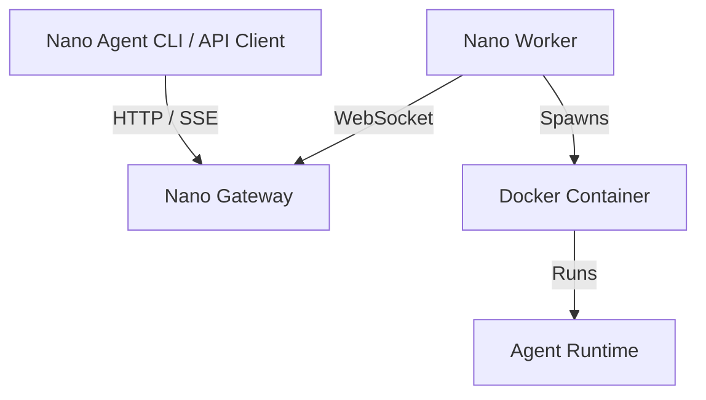

# Nano Cloud

[English](./README.md)

> [nano 系列](https://nano-harness.github.io)的一部分 —— agent 循环与 harness 工程的最小实现：[nano-symphony](https://github.com/nano-harness/nano-symphony) · [nano-agent](https://github.com/nano-harness/nano-agent) · [nano-cloud](https://github.com/nano-harness/nano-cloud)。与 [harness-101](https://github.com/albert-lv/harness-101) 课程配套。

Nano Cloud 是 **Nano Agent** 生态的 Gateway + Worker 后端，让 agent 能够在隔离的 Docker runtime 中远程执行任务。



## 各组件分别运行在哪里？

- **Gateway**：中心化的 HTTP/WebSocket 服务器，负责 Console、run 调度和配对审批。
- **Worker**：连接 Gateway，并启动隔离的 Docker runtime 容器。
- **Runtime 镜像**：`nano-agent-runtime`、`nano-cli-runtime`，以及 Worker 使用的可选 network-policy runtime。

## 安全加固

> 本工作区新增（本仓库无 CHANGELOG.md，在此简注）：Worker 配置新增可选的 `container_runtime` 键（例如 gVisor 的 `runsc`），agent 容器将以 `docker run --runtime=<值>` 启动。

对于不可信的、模型生成的代码，可以让 agent 容器运行在 gVisor（`runsc`）而非 runc 之上，并按 run 用网络策略（`none` / `allowlist` / `all`，由 `net-policy-proxy` sidecar 强制执行）限制出站。按威胁层级划分的隔离选型矩阵、完整网络策略矩阵、凭据建议以及与 nano-agent bwrap/sandbox-exec 沙箱的分层关系见 [`docs/SECURITY-HARDENING.zh-CN.md`](docs/SECURITY-HARDENING.zh-CN.md)（[English](docs/SECURITY-HARDENING.md)）。

## 定位：Harbor 式评测后端（中期）

Nano Cloud 的中期定位是 **nano-agent 大规模基准评测的执行后端**，参照 Terminal-Bench 生态中 [Harbor](https://github.com/laude-institute/harbor) 框架的范式：每个基准任务在独立容器中运行，由**独立验证器**——而非 agent 本身、也非模型——判分。评测对象是*任意完整 agent*，而不是"模型 + 固定脚手架"，因此同一套 harness 可以并排基准测试 nano-agent 的各发布版本、第三方 agent 和消融实验。

它与现有架构的对应关系：

- **Gateway** = 实验调度器：分发任务、收集 run 事件与判定结果；
- **Worker 集群** = 并行执行器：每个 run 一个容器化任务，经 `Policy.resources` 限制资源；
- **验证器（Verifier）** = 在 agent 结束后消费任务产物的独立组件——其消费路径为何必须显式审计，见 [`docs/SECURITY-HARDENING.zh-CN.md`](docs/SECURITY-HARDENING.zh-CN.md) 中的交接面原则。

目标规模：**SWE-bench 完整 500 题**与 **pass^k 多次重复实验**，需要在 worker 集群上并行执行数十到数百个 run。

一个该定位在设计上正面应对的注意事项：**评测环境本身会引入方差**——不同沙箱后端（runc 与 `runsc`）的依赖安装速度不同，会导致对超时敏感的成绩产生差异。严肃的对比需要统一硬件、固定沙箱后端并多次重复实验；让这种可复现性在集群规模上切实可行，正是 nano-cloud 作为评测后端要解决的问题之一。

## 三分钟快速开始

首次配置只需一个入口：

```bash
make quickstart
```

向导会：

1. 如有需要，从 `.env.example` 创建 `.env`；
2. 检查 Docker 和 Docker Compose；
3. 询问 Gateway URL、LLM base URL、API key、模型、镜像加速和 Go proxy；
4. 当存在同级 `../nano-agent` 检出时，构建本地 runtime 镜像；
5. 启动 Docker Compose；
6. 打印 Console URL、审批步骤、示例 run 命令和诊断命令。

本地默认配置下，打开 [http://localhost:8081/console](http://localhost:8081/console)，使用 `dev-token` 登录，批准待处理的 Worker 短码，然后从 Console 创建一个测试 run。

> 如果因为缺少 `../nano-agent` 而跳过了 runtime 镜像构建，请在本仓库旁边克隆 `nano-agent`，或在运行真实 `nano_agent` 任务前提供预构建的 runtime 镜像。

## 日常命令

```bash
make quickstart   # 配置并启动 Gateway + Worker
make logs         # 跟踪 compose 日志
make stop         # 停止服务
make reset        # 停止服务并删除本地 .workdir 状态
make test         # 运行 Go 测试
```

## 远程 Gateway 模式

只把一个 Worker 连接到已有的远程 Gateway 时：

```bash
make quickstart
```

输入你的远程 relay URL，例如 `wss://nano-gateway.example.com`。向导只会启动 Worker 服务，并打印远程 Console URL。在该 Console 中批准 Worker。

## 配置

大多数首次使用的用户只需要 `.env`：

- `RELAY_URL`：Gateway relay URL，例如 `ws://localhost:8081` 或 `wss://your-gateway.com`。
- `NANO_BASE_URL`：OpenAI 兼容的 LLM 端点。
- `NANO_API_KEY`：LLM API key。
- `NANO_MODEL`：模型名称。
- `DOCKERHUB_MIRROR`、`GOPROXY`：可选的加速设置。

Worker 的高级配置位于 [`configs/worker.example.yaml`](configs/worker.example.yaml)。Worker CLI 也可以直接生成配置文件：

```bash
go build -o bin/worker ./cmd/worker
./bin/worker quickstart
./bin/worker diagnose -relay ws://localhost:8081 --verbose
```

## Console 上手

Console 会展示：

- Gateway 健康状态和当前 Worker 状态；
- 待处理的 Worker 配对请求和短码审批；
- 一个最小化的测试 run 表单；
- 最近的 run、事件链接和 run 详情诊断。

## 故障排查

从这些命令开始：

```bash
make logs
./bin/worker diagnose -relay ws://localhost:8081 --verbose
```

常见原因：

- Docker daemon 未运行。
- Worker 未在 Console 中获批。
- 缺少 `NANO_API_KEY` 或模型设置。
- 缺少 runtime 镜像。
- 代理、Docker 镜像加速或 `GOPROXY` 设置不正确。

更底层的本地调试步骤见 [`LOCAL_DEBUG.md`](LOCAL_DEBUG.md)。

## 项目结构

- `cmd/`：Gateway、Worker 和 runtime 的二进制入口。
- `pkg/`：Gateway 和 Worker 核心逻辑。
- `proto/`：Runtime Protocol V1 的 protobuf 定义。
- `configs/`：Worker 示例配置。
- `deployment/`：生产环境 Gateway 部署辅助工具。
- `scripts/`：安装与本地运维脚本。
- `docker/`：Gateway、Worker 和 runtime 的 Dockerfile。

## 开发

需要 Go 1.24+ 和 Docker。

```bash
go build ./...
go test ./...
```

注意：本仓库当前使用了 `replace github.com/nano-harness/nano-agent => ../nano-agent`，因此构建 `cmd/runtime-nano-agent` 的命令要求存在同级 `../nano-agent` 检出。
